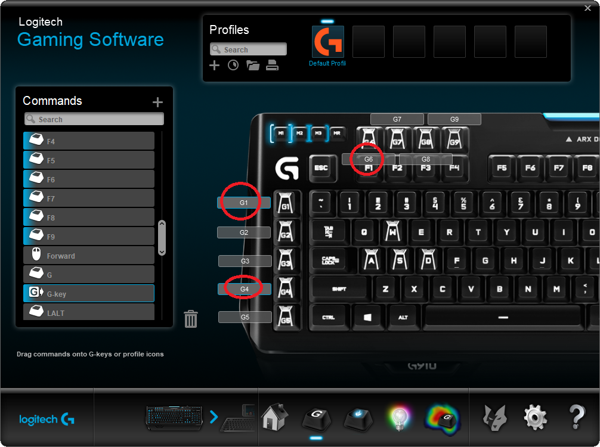
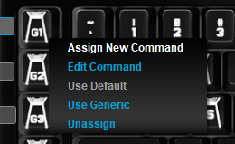
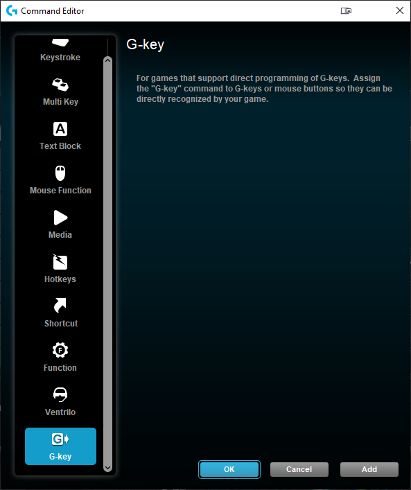

# Keyboard Scripting Tool

- With support for Logitech G-Keys and Logitech LED

## Table of contents
* [Purpose of the project](#purpose-of-project)
* [Lua configuration / example scripts](#lua-configuration)
* [Supported software](#supported-software)
* [Configuring for Logitech Gaming Software](#configuring-logitech-gaming-software)
* [Configuring for Logitech G-Hub](#configuring-g-hub)

## Purpose of project
Add LUA programming options to my Logitech G910 keyboard.  
The Logitech Gaming Software already supports this, but with a few critical shortcomings:
* It does not allow me to set the _color_ of the G-key that's currently active (missclicked something? Good luck finding out which script is running)
* It does not allow me to spam keys (a workaround is to make a macro and call PlayMacro("name")) (games with RSI inducing features, like click E 500 times to plant/loot 500 times)
* It does not receive input events from regular keys (cannot cancel autorun on 'W' for example, sending you off a cliff to die)

The purpose of this tool is to correct some of these shortcomings. (and possibly introduce new issues ;))  

## Supported software:
* Microsoft Windows
* [Logitech Gaming Software](#configuring-logitech-gaming-software)
* [Logitech G-Hub](#configuring-g-hub)

### Example scripts:
* Satisfactory (autorun and spam E) ([satisfactory.lua](./Docs/satisfactory.lua))
* Example script ([example.lua](./KST/Resources/example.lua))

### Missing/TODO:
* Macro support? (Undecided, is it even possible?)
* Reset the LUA script on command (currently crashes if called)
* Probably several bugs still not discovered.
* A fallback profile (if a profile is in use, but does not map this key) + a default profile (if no other profile is in use)
 

## Getting started (Logitech Gaming Software)
#### Configuring Logitech Gaming Software

In order to best use the G-keys with this application, they should be configured to be G-keys inside the Logitech Gaming Software:

  

**Hover over the G-key:**  

**Select "Assign new command"**  

**Assign it to "G-Key" (you may need to scroll down)**   

**When you start this program for the first time, it will start minimized to tray.**  
The program is running, look for it down in the bottom right corner.

## Getting started (Logitech G-Hub)
#### Configuring G-Hub

The keys will need to be configured in G-Hub, and your LUA script should listen for whichever key is configured in G-Hub.  

The integration has been verified to work, but no detailed setup guide for G-Hub is available.  

**When you start this program for the first time, it will start minimized to tray.**  
The program is running, look for it down in the bottom right corner.

Obs: May also need to click the "Allow games & applications to control illumination" setting in G-Hub

## Lua configuration  

The .lua file must have a function called `OnEvent`. See [example.lua](./Logitech/Resources/example.lua) for details on usage.

